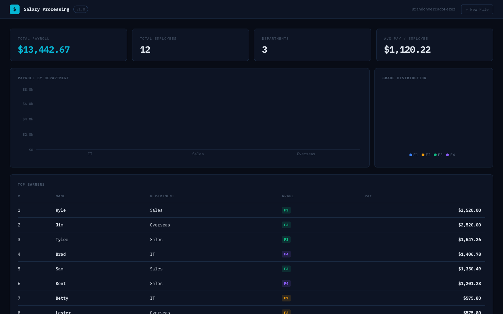

# Salary Processing

A command-line payroll parser written in C++. Built using only fundamental language concepts — loops, strings, file I/O, and `iomanip` for formatting. No STL vectors, no `istringstream`, no shortcuts.

---

## Terminal Output

```
+--------------------------------------------------------------------------------------------------+
| The IT Department                                                                                |
| Total Salary: $                  3075.70                                                         |
| Total Hours:                      168.00                                                         |
| Total Employees:                       4                                                         |
| Roster: Bill, Betty, Brandon, Brad                                                               |
|                                                                                                  |
| F1 Stats                                          F3 Stats                                       |
| Total Salary: $                   413.10          Total Salary: $                     0.00       |
| Total Hours:                       34.00          Total Hours:                        0.00       |
| Total Employees:                       1          Total Employees:                       0       |
|                                                                                                  |
| F2 Stats                                          F4 Stats                                       |
| Total Salary: $                  1255.82          Total Salary: $                  1406.78       |
| Total Hours:                       83.50          Total Hours:                       50.50       |
| Total Employees:                       2          Total Employees:                       1       |
+--------------------------------------------------------------------------------------------------+

+--------------------------------------------------------------------------------------------------+
| The Sales Department                                                                             |
| Total Salary: $                  7147.45                                                         |
| Total Hours:                      181.00                                                         |
| Total Employees:                       5                                                         |
| Roster: Kyle, Tyler, Konner, Sam, Kent                                                           |
|                                                                                                  |
| F1 Stats                                          F3 Stats                                       |
| Total Salary: $                     0.00          Total Salary: $                  5417.75       |
| Total Hours:                        0.00          Total Hours:                      100.00       |
| Total Employees:                       0          Total Employees:                       3       |
|                                                                                                  |
| F2 Stats                                          F4 Stats                                       |
| Total Salary: $                   528.42          Total Salary: $                  1201.28       |
| Total Hours:                       36.50          Total Hours:                       44.50       |
| Total Employees:                       1          Total Employees:                       1       |
+--------------------------------------------------------------------------------------------------+

+--------------------------------------------------------------------------------------------------+
| The Overseas Department                                                                          |
| Total Salary: $                  3399.55                                                         |
| Total Hours:                      104.00                                                         |
| Total Employees:                       3                                                         |
| Roster: Jim, Frank, Lester                                                                       |
|                                                                                                  |
| F1 Stats                                          F3 Stats                                       |
| Total Salary: $                   303.75          Total Salary: $                  2520.00       |
| Total Hours:                       25.00          Total Hours:                       40.00       |
| Total Employees:                       1          Total Employees:                       1       |
|                                                                                                  |
| F2 Stats                                          F4 Stats                                       |
| Total Salary: $                   575.80          Total Salary: $                     0.00       |
| Total Hours:                       39.00          Total Hours:                        0.00       |
| Total Employees:                       1          Total Employees:                       0       |
+--------------------------------------------------------------------------------------------------+
```

---

## Pay Grade Rules

| Grade | Type | Calculation |
|-------|------|-------------|
| F1 | Hourly | `total hours × $12.15` |
| F2 | Salaried | `$500.00 base + (hours over 35) × $18.95` |
| F3 | Commission | `sales amount × rate` · 30 req. hrs if rate ≤ 10%, else 40 |
| F4 | Weekly | `weekday hours (Mon–Fri) × $26.55 + weekend hours (Sat–Sun) × $39.75` |

**Time rounding (F1, F2, F4):** minutes are accumulated across all entries, then rounded once — 1–29 min → 0.5 hr, 30+ min → 1.0 hr.

---

## Input Format

```
The IT Department
Bill 8 hours 20 minutes 7hours 8hours 30 minutes 9hrs 10min 57 minutes F1
Betty 8hrs 8hrs 30min 7hrs 5min 8hrs 7hrs 10min F2
Brad 9hrs 8hrs 10hrs 12min 9hrs 4min 8hours 6min 3hrs 24min 1hr 6min F4
The Sales Department
Kyle $24,000 0.105 F3
```

- Lines starting with `The` are department headers
- Last token on any other line is the pay grade (`F1`–`F4`)
- First token is the employee name
- Everything between is pay data — time entries for F1/F2/F4, or `$amount rate` for F3

---

## Compile & Run

```bash
g++ PayrollParser.cpp -o PayrollParser
./PayrollParser
```

Reads from `input.txt` in the same directory. Output prints directly to the terminal.

---

## Web App

A React + Vite dashboard built on top of this same parsing logic, with KPI cards, charts, and collapsible department breakdowns.

[View Web App →](web/)

## Screenshots

**Input screen** — drag-and-drop a `.txt` file or paste raw text:


**Dashboard** — KPI cards, payroll by department, grade distribution, top earners:



---

## Author

**Brandon Mercado Perez**
