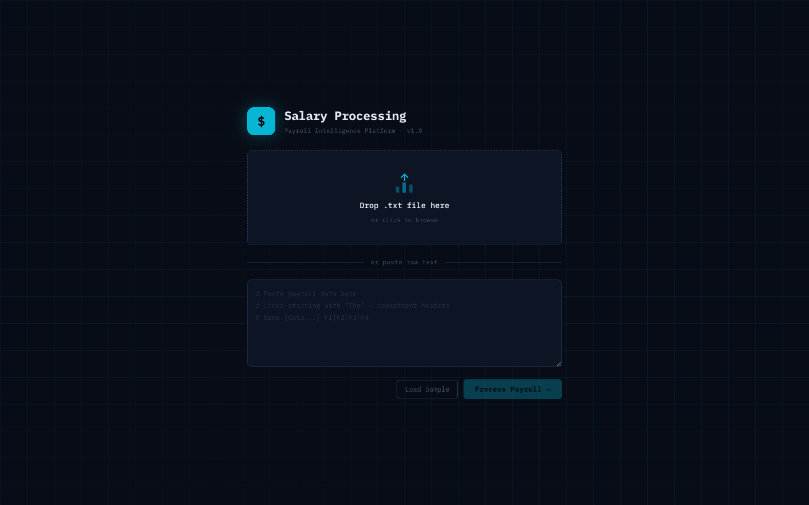
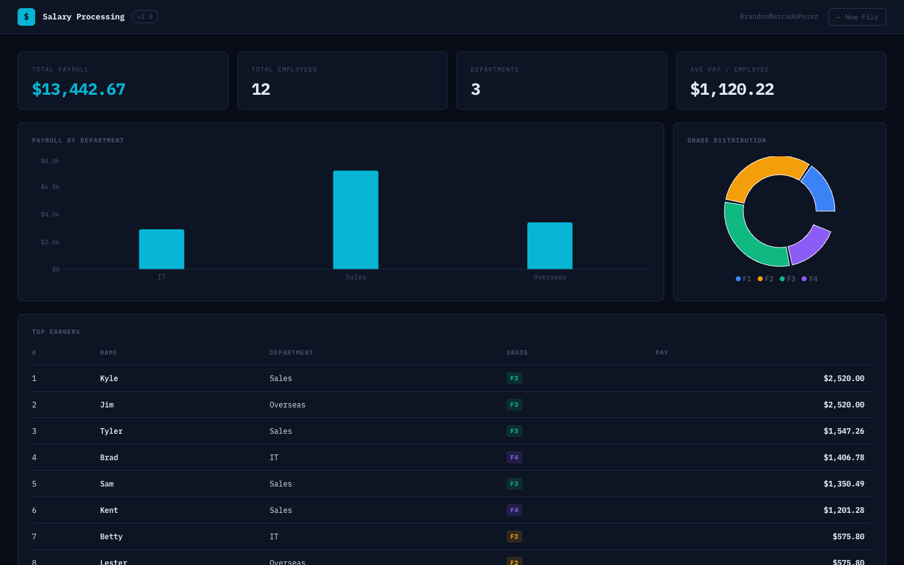
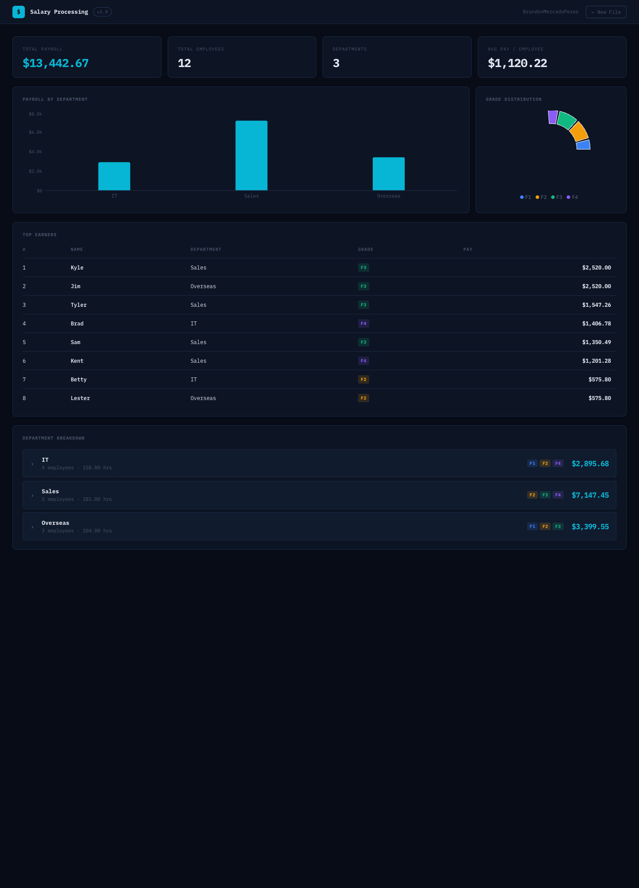

# Salary Processing — Web

A React + Vite dashboard built on top of the [C++ payroll parser](../README.md) in this repo. Parses the same plaintext payroll files and renders an interactive finance dashboard.

---

## Running Locally

```bash
# From the /web directory
npm install
npm run dev
```

Open [http://localhost:5173](http://localhost:5173) in your browser.

---

## What It Does

**Screen 1 — Input**
- Drag-and-drop a `.txt` payroll file or paste raw text directly
- Load sample data for quick testing

**Screen 2 — Dashboard**
- KPI cards: Total Payroll, Total Employees, Departments, Avg Pay per Employee
- Bar chart: payroll broken down by department
- Donut chart: employee distribution across pay grades (F1–F4)
- Top Earners table ranked by pay
- Collapsible department cards with per-employee grade breakdown

---

## Tech Stack

| | |
|---|---|
| **Framework** | React 18 |
| **Build tool** | Vite 6 |
| **Charts** | Recharts |
| **Font** | IBM Plex Mono |

---

## Screenshots

**Screen 1 — Input**



**Screen 2 — Dashboard (KPI cards · bar chart · donut chart)**



**Screen 2 — Dashboard (top earners · department breakdown)**


